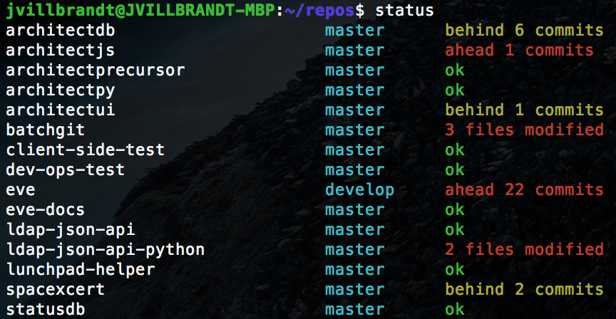

# batchgit

Runs git commands on multiple repositories.

## Installation

```bash
git clone https://github.com/joshvillbrandt/batchgit.git
cd batchgit/
sudo pip install -r requirements.txt
sudo sh -c 'echo python ${PWD}/batchgit.py status > /usr/local/bin/status'
sudo chmod a+x /usr/local/bin/status
```

## Usage

Right now, this command only support getting the status of a bunch of repositories that are under one directory. You can call the Python script directory or use the shortcut bash script that was installed:

```bash
cd ~repos/
python batchgit.py status
# or if you created the symlink during install
status
```


